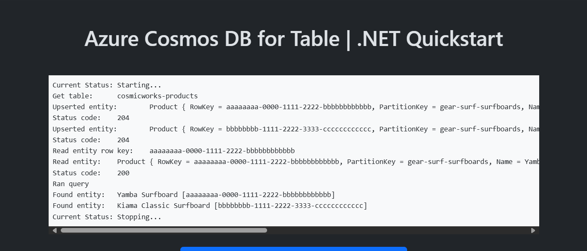

# Quickstart: Azure Cosmos DB for Table - Azure SDK for .NET

This is a simple Blazor web application to illustrate common basic usage of Azure Cosmos DB for Table with the Azure SDK for .NET.



<sup>Screenshot of the deployed web application.</sup>

### Prerequisites

> *This template will create infrastructure and deploy code to Azure. If you don't have an Azure Subscription, you can sign up for a [free Azure account](https://azure.microsoft.com/free/). Make sure you have the contributor role in the Azure subscription.*

The following prerequisites are required to use this application. Please ensure that you have them all installed locally.

- [Azure Developer CLI](https://aka.ms/azd-install)
- [.NET SDK 8.0](https://dotnet.microsoft.com/download/dotnet/8.0)

### Quickstart

This quickstart will show you how to authenticate on Azure, initialize using a template, provision infrastructure and deploy code on Azure via the following commands:

```bash
# Log in to azd. Only required once per-install.
azd auth login

# First-time project setup. Initialize a project in the current directory, using this template.
# Omit the --template argument if you are running in a development container.
azd init --template cosmos-db-table-dotnet-quickstart

# Provision and deploy to Azure
azd up
```
